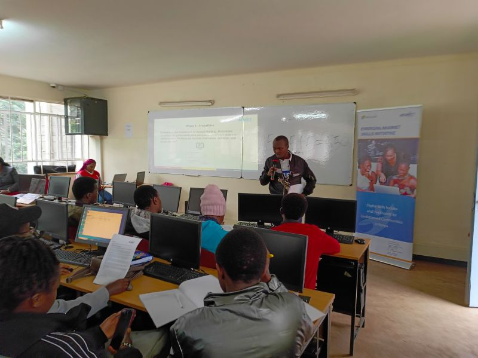

👨‍🏫 Trainer Experience with St. Paul University Students 👩‍🎓\
Being a trainer for the St. Paul University students during the ACWICT Week of Code Workshop was an enriching experience. 🌟\
🎯 [\#MentoringTheFuture](https://www.linkedin.com/feed/hashtag/?keywords=mentoringthefuture&highlightedUpdateUrns=urn%3Ali%3Aactivity%3A7119956907053756416): As a trainer, I had the privilege of working with bright and motivated students from St. Paul University, guiding them through a week of immersive learning.\
💡 Unlocking Potential: It was truly inspiring to witness these students as they delved into ideation, problem-solving, coding, soft skills, and business pitch development. They embraced every challenge with enthusiasm.\
🤝 [\#CollaborationMatters](https://www.linkedin.com/feed/hashtag/?keywords=collaborationmatters&highlightedUpdateUrns=urn%3Ali%3Aactivity%3A7119956907053756416): Collaborative learning was at the heart of our journey. Students actively participated in group projects, discussions, and coding labs. They built a positive and inclusive environment where ideas flourished.\
🚀 [\#CodingSkills](https://www.linkedin.com/feed/hashtag/?keywords=codingskills&highlightedUpdateUrns=urn%3Ali%3Aactivity%3A7119956907053756416): It was a delight to see them enhance their technical coding skills, master various concepts, and take ownership of their learning journey. They now have a strong foundation for success in the tech world.\
🌐 [\#RealWorldProjects](https://www.linkedin.com/feed/hashtag/?keywords=realworldprojects&highlightedUpdateUrns=urn%3Ali%3Aactivity%3A7119956907053756416): The experience of working on real-world projects gave them insights into the practical applications of their skills. They are ready to tackle the demands of the industry.\
🙏 [\#Gratitude](https://www.linkedin.com/feed/hashtag/?keywords=gratitude&highlightedUpdateUrns=urn%3Ali%3Aactivity%3A7119956907053756416): I'm grateful for the opportunity to contribute to their growth and education. Kudos to the St. Paul University students for their dedication and the ACWICT team for their support.\
Thanks to [John Karanja](https://www.linkedin.com/in/ACoAABBdN6wBSpVVQIm3KIpNxAbtCkiy6NgagZ0) , [Njogu Grace](https://www.linkedin.com/in/ACoAABfeTBYBBiiUM142EFxiPnEan5rlpYNlXnQ) and [Ignatius Ouma](https://www.linkedin.com/in/ACoAACqmPawBhzJDHyNIqXv9R0lExolgyGM8Dkc) for your support.\
[\#TrainerExperience](https://www.linkedin.com/feed/hashtag/?keywords=trainerexperience&highlightedUpdateUrns=urn%3Ali%3Aactivity%3A7119956907053756416) [\#StPaulUniversity](https://www.linkedin.com/feed/hashtag/?keywords=stpauluniversity&highlightedUpdateUrns=urn%3Ali%3Aactivity%3A7119956907053756416) [\#TechEducation](https://www.linkedin.com/feed/hashtag/?keywords=techeducation&highlightedUpdateUrns=urn%3Ali%3Aactivity%3A7119956907053756416) [\#FutureLeaders](https://www.linkedin.com/feed/hashtag/?keywords=futureleaders&highlightedUpdateUrns=urn%3Ali%3Aactivity%3A7119956907053756416) [\#CodingJourney](https://www.linkedin.com/feed/hashtag/?keywords=codingjourney&highlightedUpdateUrns=urn%3Ali%3Aactivity%3A7119956907053756416) [\#LearningExperience](https://www.linkedin.com/feed/hashtag/?keywords=learningexperience&highlightedUpdateUrns=urn%3Ali%3Aactivity%3A7119956907053756416) [\#ACWICT](https://www.linkedin.com/feed/hashtag/?keywords=acwict&highlightedUpdateUrns=urn%3Ali%3Aactivity%3A7119956907053756416) [\#SkillsDevelopment](https://www.linkedin.com/feed/hashtag/?keywords=skillsdevelopment&highlightedUpdateUrns=urn%3Ali%3Aactivity%3A7119956907053756416)

