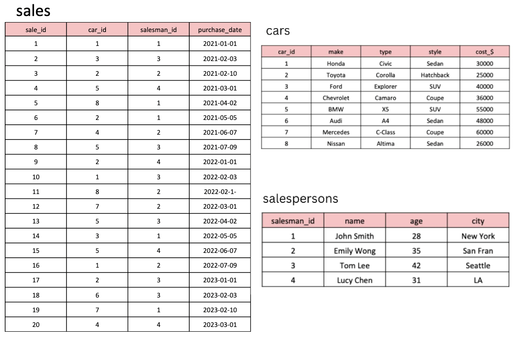

```sql
CREATE TABLE cars (
car_id INT PRIMARY KEY,
make VARCHAR(50),
type VARCHAR(50),
style VARCHAR(50),
cost_$ INT
);
```

```sql
INSERT INTO cars (car_id, make, type, style, cost_$)
VALUES (1, 'Honda', 'Civic', 'Sedan', 30000),
(2, 'Toyota', 'Corolla', 'Hatchback', 25000),
(3, 'Ford', 'Explorer', 'SUV', 40000),
(4, 'Chevrolet', 'Camaro', 'Coupe', 36000),
(5, 'BMW', 'X5', 'SUV', 55000),
(6, 'Audi', 'A4', 'Sedan', 48000),
(7, 'Mercedes', 'C-Class', 'Coupe', 60000),
(8, 'Nissan', 'Altima', 'Sedan', 26000);

CREATE TABLE salespersons (
salesman_id INT PRIMARY KEY,
name VARCHAR(50),
age INT,
city VARCHAR(50)
);
```