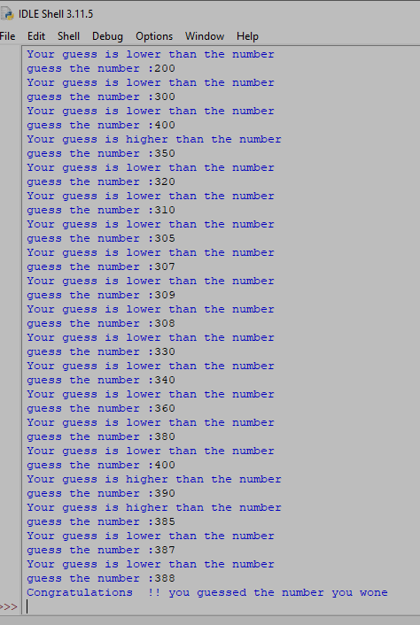

How the Game Works:

1. Change the number range from 1 to 10000
2. Game should ask us to guess the number
3. Give a clue if the number is higher or lower than the guess
4. Inform the player if he won

   ```python
   from random import randint
   start=1
   end=1000

   value=randint(start, end)

   print("The computer choose a number between",start, "and",end)


   guess=None
   while guess!=value:
       text=input("guess the number :")
       guess=int(text)

       if(guess<value):
           print("Your guess is lower than the number")

       elif guess > value:
           
           print("Your guess is higher than the number")

   print("Congratulations  !! you guessed the number you wone")   
   ```


